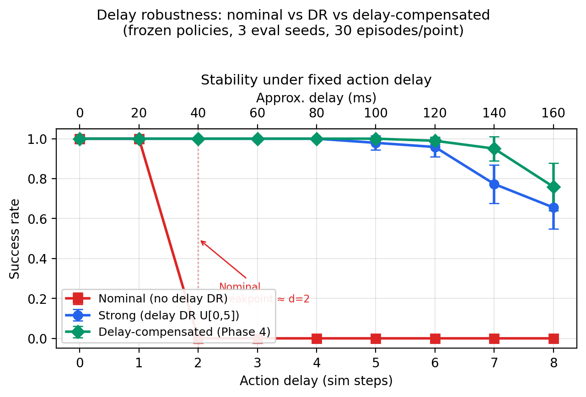
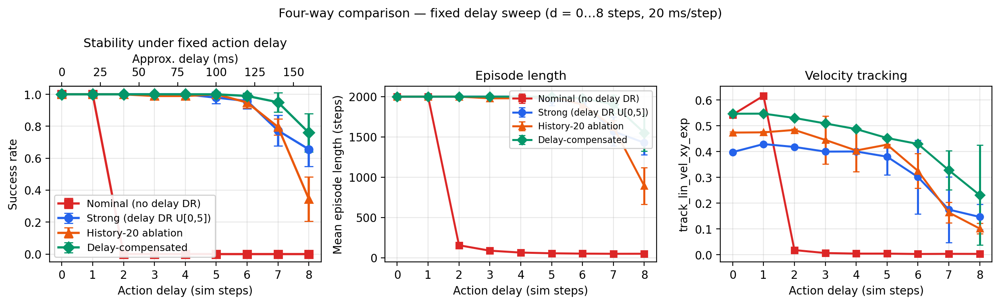
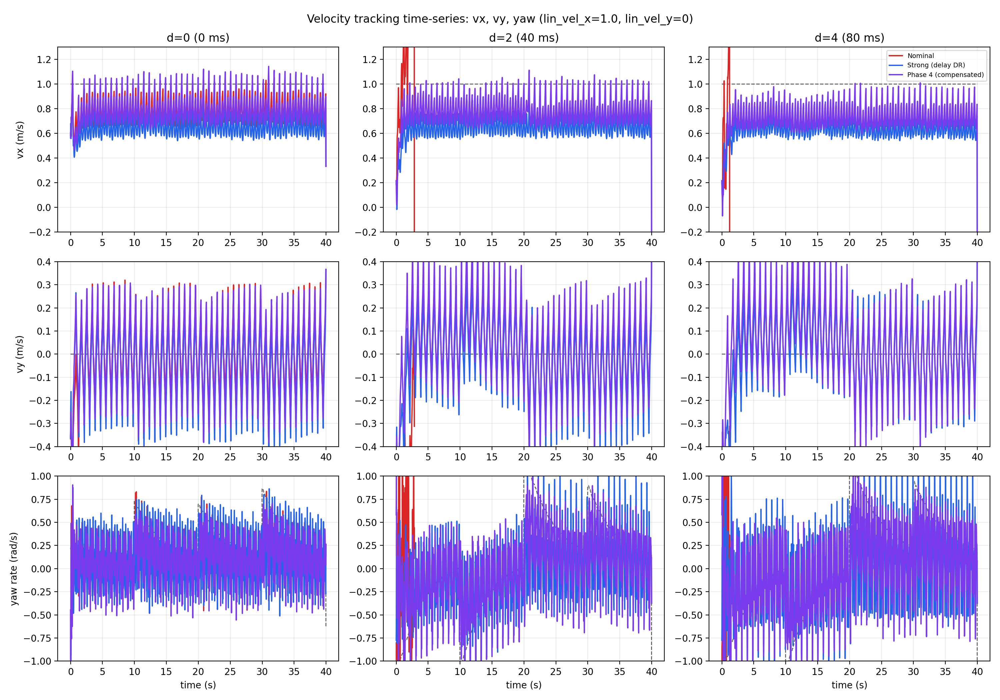

# Humanoid Learning Control

**MSc dissertation — redesigning the walking controller for action-delay robustness**

Real humanoid stacks suffer **action delay** (network, inference, actuation). A nominal AMP-PPO walker fails once delay exceeds ~40 ms. This repo implements a **controller redesign** — not just delay domain randomisation (DR), but a **two-stage learning pipeline** that predicts delayed observations and fine-tunes a compensated walking policy.

<p align="center">
  
  <br/>
  <em>TienKung humanoid walking in simulation. Swap in an Isaac Lab clip of the delay-compensated policy at fixed delay (e.g. 4 steps) once recorded — see below.</em>
</p>

| Baseline | What it does |
|----------|----------------|
| **Nominal** | Standard walk policy, no delay DR |
| **Strong (DR)** | Trained with uniform delay DR U[0, 5] steps |
| **History-20 ablation** | Longer observation history (h=20), same DR, no predictor |
| **Delay-compensated (this work)** | Stage 1 observation predictor + Stage 2 fine-tuned policy under the same DR budget |

## Results

### Main delay sweep (4 policies, fixed delay, 3 eval seeds)

<p align="center">
  
  <br/><sub>Success rate — nominal / strong DR / history-20 / delay-compensated</sub>
</p>

<p align="center">
  
  <br/><sub>Success rate · episode length · velocity tracking reward</sub>
</p>

### Velocity tracking time-series (lin_vel_x = 1.0 m/s, d = 0 / 2 / 4 steps)

<p align="center">
  
  <br/><sub>Commanded vs actual vx, vy, yaw — all four policies</sub>
</p>

The redesigned controller (**green**) stays stable where nominal collapses. History-20 (**orange**) helps at moderate delay but falls behind compensated at d=8 (160 ms).

### Raw eval CSV (reproduce figures)

| Policy | Aggregated CSV |
|--------|----------------|
| Nominal | [`eval_nominal_agg.csv`](results/csv/eval_nominal_agg.csv) |
| Strong (DR) | [`eval_strong_agg.csv`](results/csv/eval_strong_agg.csv) |
| History-20 ablation | [`eval_history20_agg.csv`](results/csv/eval_history20_agg.csv) |
| Delay-compensated | [`eval_compensated_agg.csv`](results/csv/eval_compensated_agg.csv) |

Tracking time-series: [`results/csv/tracking/`](results/csv/tracking/) (12 clips, seed 42).

Training budget: 2048 envs, 15k iterations, seed 42.

## Stack

- Isaac Sim 4.5, Isaac Lab 2.1
- [TienKung-Lab](https://github.com/Open-X-Humanoid/TienKung-Lab) (clone separately; not included here)
- Python 3.10, CUDA GPU for training and eval

## Install into TienKung-Lab

Copy files from this repo into your TienKung-Lab tree (same relative paths):

```
rsl_rl/modules/predictor.py
rsl_rl/modules/delay_policy.py          -> also register as ActorCriticDelayPredictor in modules/__init__.py
legged_lab/envs/tienkung/walk_compensated_cfg.py
legged_lab/envs/tienkung/walk_history_ablation_cfg.py
legged_lab/envs/tienkung/env_patch.py     -> run once to patch tienkung_env.py
legged_lab/scripts/*.py
```

Register tasks in `legged_lab/envs/__init__.py` (see comments in the cfg files). Register `delay_policy.ActorCriticDelayPredictor` in `rsl_rl/rsl_rl/modules/__init__.py` and runners.

## Training (on GPU server)

From `TienKung-Lab/` with conda env active:

```bash
# Strong baseline (delay DR U[0,5])
python legged_lab/scripts/train_strong_baseline.py --task=walk --headless --num_envs=2048 --max_iterations=15000 --seed=42

# Stage 1 — observation predictor (supervised)
python legged_lab/scripts/train_predictor.py --task=walk --headless --num_envs=2048 --seed=42 --predictor_path=...

# Stage 2 — compensated policy (load predictor + fine-tune)  *** controller redesign ***
python legged_lab/scripts/train_compensated_policy.py --task=walk_delay_comp --headless --num_envs=2048 --max_iterations=15000 --predictor_path=... --init_policy_path=...

# Ablation: long history (h=20), same DR, no predictor
python legged_lab/scripts/train_long_history.py --task=walk_history_ablation --headless --num_envs=2048 --max_iterations=15000 --seed=42
```

Checkpoints stay under `TienKung-Lab/logs/` (not tracked in git).

## Evaluation

```bash
python legged_lab/scripts/eval_robustness.py --headless --task walk \
  --policy_path /path/to/policy.pt --intervention delay --action_delay_steps 4 --delay_mode fixed

python legged_lab/scripts/aggregate_eval.py results/csv/eval_nominal.csv --out results/csv/eval_nominal_agg
```

## Deployment evidence

The repository now separates deployment engineering from hardware-originated
evidence. The code below is reviewable without claiming that a physical
TienKung run has already happened.

| Evidence | Current status | What a reviewer can verify |
|---|---|---|
| ROS 2/C++ deployment bridge | Implemented and unit-tested | Joint-name mapping, watchdog, explicit enable/fault modes, position and rate limits |
| Policy export and inference | Implemented; generated artifact manifest pending | TorchScript/ONNX packaging, hash manifest, shape/finite checks and latency measurement |
| Isaac Lab video and results | Available | Simulation execution and delay-robustness evaluation |
| Exact hardware mapping | Locked pending robot-owner review | Default config cannot activate with guessed joint names |
| MuJoCo Sim-to-Sim | Not currently evidenced | Must not be claimed until config, logs and video exist |
| Physical video/telemetry/rosbag | Not currently available | Evidence contract defines what a future real session must capture |
| Failure record | Available for supported simulator/code failures | Reproducible symptoms, evidence and fixes without invented hardware incidents |

- [Deployment package and commands](deployment/README.md)
- [Claim-by-claim evidence status](deployment/EVIDENCE_STATUS.md)
- [Failure and debugging record](deployment/evidence/FAILURE_LOG.md)
- [Physical-hardware evidence contract](deployment/evidence/hardware_validation/README.md)

## Author

[glori-a-a](https://github.com/glori-a-a)

## Citation

If you use this code, cite the TienKung-Lab paper and your dissertation reference as appropriate.
